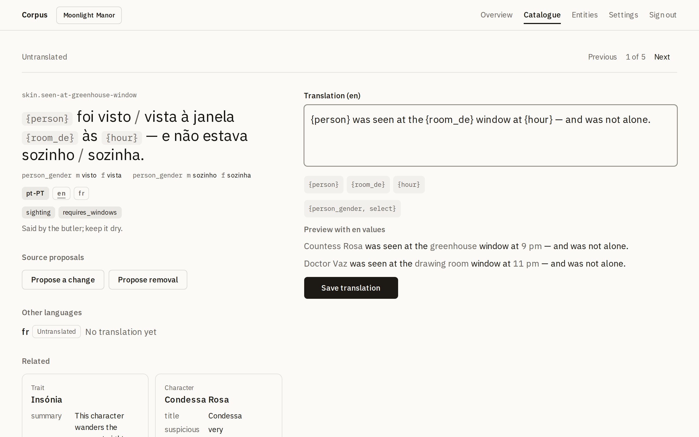
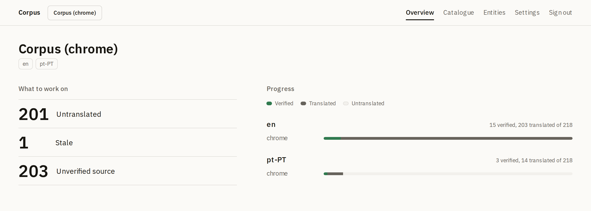
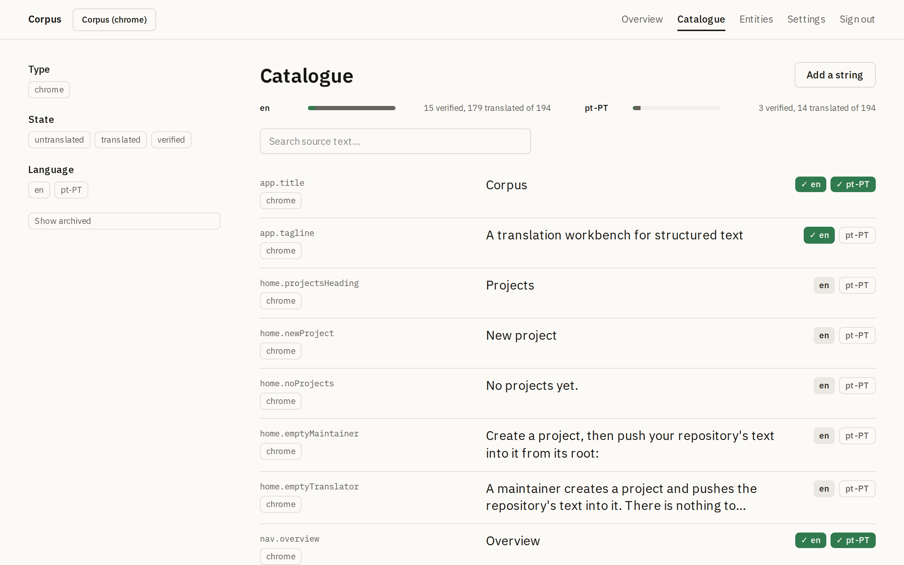
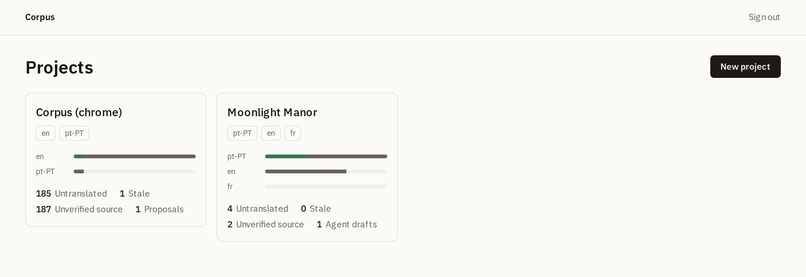
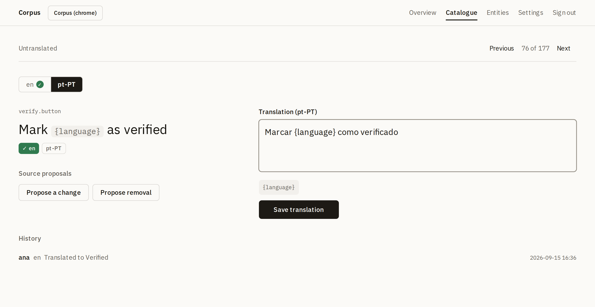
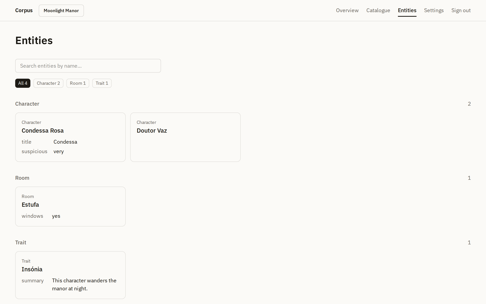
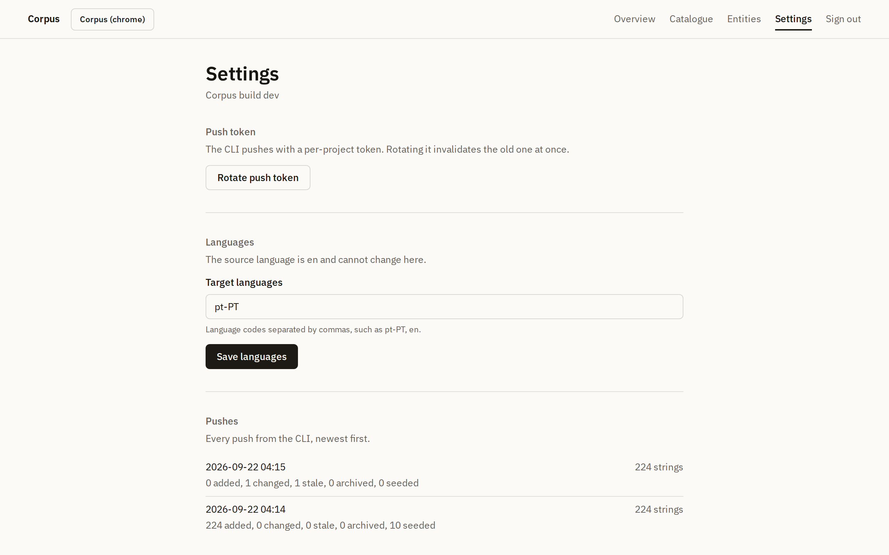
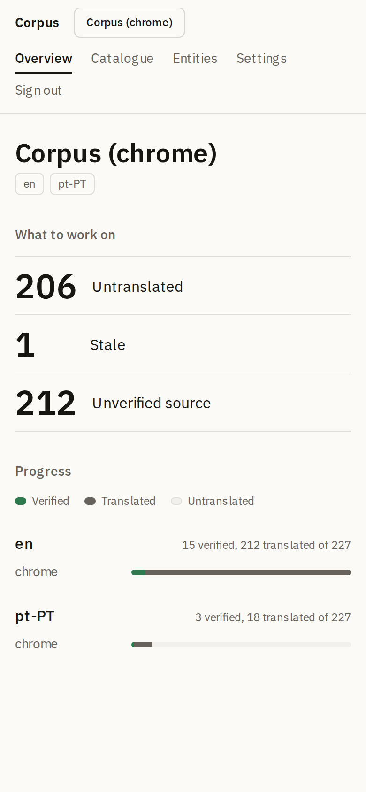

<h1 align="center">Corpus</h1>

<p align="center">
  A self-hosted translation workbench for games and apps whose text is structured.<br>
  Your repository stays the source of truth. Corpus is where people translate and verify it.
</p>

<p align="center">
  <a href="https://github.com/miguelaguiar01/corpus/actions/workflows/gate.yml"></a>
  
  
  
  <a href="https://www.npmjs.com/package/@corpus-tool/cli"></a>
</p>

<p align="center">
  <picture>
    <source media="(prefers-color-scheme: dark)" srcset="docs/screenshots/editor-structured-desktop-dark.png">
    
  </picture>
</p>

<p align="center"><em>A string from the fixture project, Moonlight Manor: one sentence, two gendered selects, three placeholders, and a live preview for each example the repository shipped with it.</em></p>

## Why Corpus

Flat key-value translation tools lose what makes game and app text hard: the placeholder that arrives with a Portuguese contraction baked in, the select that branches on a character's gender, the room the sentence is about. Corpus keeps all of it in view while someone translates.

- **Structured text, first class.** Strings carry placeholders, ICU selects, metadata, and references to the entities they mention. The editor renders a select as its branches, never as syntax, and chips insert placeholders and select skeletons so nobody types braces by hand.
- **Previews without running your code.** Each string can ship examples, slot values plus the source render, and the editor substitutes them into the draft as it is typed, one preview per example, both branches of a select exercised.
- **The repository stays the truth.** `corpus push` diffs the repo into Corpus by string id; `corpus pull` writes verified translations back through the same adapters, format-preserving. Push then pull reproduces the repository byte for byte, and that invariant is a test in the gate.
- **A workflow, not a spreadsheet.** Every string and language moves untranslated, translated, verified, with a stale mark when the source changes underneath, an attributed history of every edit, and queues that tell a translator what to work on next.
- **One container.** Next.js and SQLite in a single image with its database on a volume. No external services, no accounts, one invite secret for the instance.
- **Made for a phone in one hand.** Translators mostly work on phones, so every surface was designed at 390px first, with the desktop layouts built out from there.

Corpus translates its own interface with itself. That is the standing demo in these screenshots and a test that runs on every build.

## Quick start

You need Docker and nothing else.

```sh
git clone https://github.com/miguelaguiar01/corpus.git
cd corpus
docker build -t corpus .
docker run -d --name corpus \
  -p 3000:3000 \
  -e CORPUS_INVITE_SECRET="$(openssl rand -hex 24)" \
  -v corpus-data:/data \
  corpus
```

Open http://localhost:3000, enter the invite secret you just set and a display name. The first person to join becomes the instance maintainer. All data lives in the `corpus-data` volume; the container is disposable.

With Docker Compose, or a PaaS that reads `compose.yaml`:

```sh
CORPUS_INVITE_SECRET="$(openssl rand -hex 24)" docker compose up -d
```

Two things to know before exposing it: mount a directory, never a single file (SQLite runs in WAL mode and keeps `-wal` and `-shm` files beside the database), and put it behind HTTPS to reach it from other devices, because the session cookie is `Secure` in production. `/api/health` reports the build it is running, so an instance is traceable to a commit without logging in.

## Connect a repository

In the repository whose text you want translated, install the CLI and let it write the config:

```sh
npm install --save-dev @corpus-tool/cli
npx corpus init --project my-game --source en --languages en,pt-PT \
  --messages "src/i18n/{lang}.json" --server http://localhost:3000
```

That writes a `corpus.config.ts`, the whole configuration for a repository whose strings are a plain message catalog. The CLI never guesses where text lives; the config declares it:

```ts
import { defineCorpus } from "@corpus-tool/cli";

export default defineCorpus({
  project: "my-game",
  server: "http://localhost:3000",
  sourceLanguage: "en",
  languages: ["en", "pt-PT"],
  sources: [
    { adapter: "messages", type: "chrome", path: "src/i18n/{lang}.json" },
  ],
});
```

Create the project in Corpus (the instance shows you its push token once), then:

```sh
export CORPUS_TOKEN=<token>
npx corpus push                       # repo → Corpus: adds, changes, marks stale, archives
npx corpus pull                       # Corpus → repo: verified translations only
npx corpus pull --min-state translated  # Corpus → repo: translated and verified
npx corpus check                      # lint: user-facing literals outside declared sources
```

Pushing is a diff by string id: new ids are added, changed source text marks its translations stale, ids that disappear are archived with their history kept. Pulling writes translations back and prints only the files it changed. Node 22 or later; a TypeScript config needs no build step.

Structured sources, `table` records with metadata fields or an `exec` command that emits entries, are described in the [design spec, §3](docs/corpus-design.md).

## How it works

```
repository ──corpus push──▶ Corpus (people verify and translate) ──corpus pull──▶ repository files ──PR──▶ merged
```

Source text and metadata belong to the repository; translations and workflow states belong to Corpus. The database is a working copy with history: losing it loses only edits not yet pulled.

| Surface   | What it is for                                                                                                                                            |
| --------- | --------------------------------------------------------------------------------------------------------------------------------------------------------- |
| Dashboard | The three queues (untranslated, stale, unverified source) and per-language progress by string type. A translator never wonders what to work on.           |
| Catalogue | Every string, searched (accent-insensitive full text) and filtered by type, state, language, and the project's own metadata.                              |
| Editor    | The source with its branches, placeholders, metadata, entities and examples on one side; the draft with chips, validation and live previews on the other. |
| Entities  | Read-only cards for the characters, rooms and other objects the strings refer to.                                                                         |
| Settings  | The push token, languages, push history, and the people on the instance. Maintainers only.                                                                |

## Screens

<p align="center">
  <picture>
    <source media="(prefers-color-scheme: dark)" srcset="docs/screenshots/dashboard-desktop-dark.png">
    
  </picture>
</p>

<p align="center">
  <picture>
    <source media="(prefers-color-scheme: dark)" srcset="docs/screenshots/catalogue-desktop-dark.png">
    
  </picture>
</p>

<details>
<summary>More screens: home, a plain string in the editor, the entity browser, settings, and a phone</summary>
<p align="center">
  <picture>
    <source media="(prefers-color-scheme: dark)" srcset="docs/screenshots/home-desktop-dark.png">
    
  </picture>
  <picture>
    <source media="(prefers-color-scheme: dark)" srcset="docs/screenshots/editor-desktop-dark.png">
    
  </picture>
  <picture>
    <source media="(prefers-color-scheme: dark)" srcset="docs/screenshots/entities-desktop-dark.png">
    
  </picture>
  <picture>
    <source media="(prefers-color-scheme: dark)" srcset="docs/screenshots/settings-desktop-dark.png">
    
  </picture>
  <picture>
    <source media="(prefers-color-scheme: dark)" srcset="docs/screenshots/dashboard-dark.png">
    
  </picture>
</p>
</details>

Every screen follows the system light or dark preference. The visual system, the tokens, the type scale and the rules behind it, is written down in [`docs/design.md`](docs/design.md).

## Configuration

Environment variables are documented in [`apps/web/.env.example`](apps/web/.env.example). Local and container runs share one code path; only these differ by environment:

| Variable               | Local default                  | Container                       |
| ---------------------- | ------------------------------ | ------------------------------- |
| `CORPUS_INVITE_SECRET` | required, from `apps/web/.env` | `-e` at `docker run`            |
| `CORPUS_DB_PATH`       | `apps/web/data/corpus.db`      | `/data/corpus.db` on the volume |
| `PORT`                 | `3000`                         | `3000`                          |

Migrations apply automatically when the app starts, and the boot log names the database file it opened.

## Local development

The same app runs as a plain local process. You need Node 22 (see `.nvmrc`) and npm:

```sh
git clone https://github.com/miguelaguiar01/corpus.git
cd corpus
npm install
cp apps/web/.env.example apps/web/.env   # then set CORPUS_INVITE_SECRET
npm run dev
```

The database is created on first start at `apps/web/data/corpus.db` and is gitignored; delete it to start over.

`bin/gate` is the one quality gate, locally and in CI: typecheck, lint, format, the CLI build, the full test suite, and `corpus check` on this repository's own interface strings. `bin/smoke` walks the whole loop in a browser, invite to verified translation, on a phone viewport and then checks the desktop layouts; `bin/container-smoke` builds and boots the production image; `bin/install-smoke` installs the packed CLI into a fresh repository and round-trips it against that image; `bin/screenshots` regenerates the images above. Releases are tags: see `AGENTS.md`.

## Documentation

- [`docs/corpus-design.md`](docs/corpus-design.md), the binding design: the data model, the ICU subset, sync semantics, the round-trip invariant, and what Corpus deliberately does not do.
- [`docs/design.md`](docs/design.md), the visual system.
- [`docs/DECISIONS.md`](docs/DECISIONS.md), architecture decisions as they were made.
- [`AGENTS.md`](AGENTS.md), how work happens here: the spec is binding, the gate must pass before a PR, every PR is reviewed by someone other than its author, and the round-trip invariant is never merged red.

## Status

The MVP is complete, the interface has been through a full design pass, and the CLI ships on npm as `@corpus-tool/cli`. Corpus runs its own translation into Portuguese from this repository, on every build, and every release installs the packed CLI into a fresh repository and round-trips it before publishing. Next: a first outside project, with its feedback folded back in.
