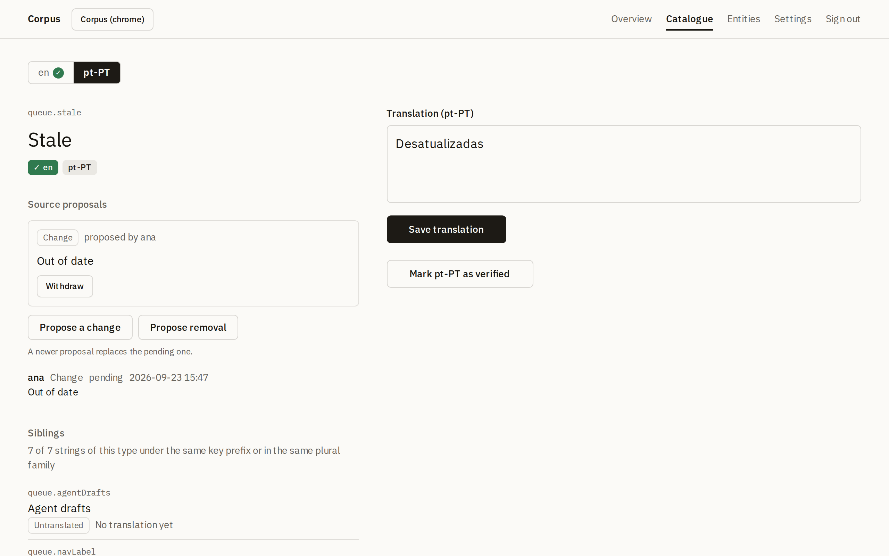
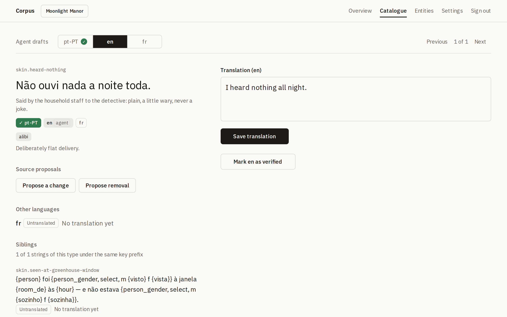
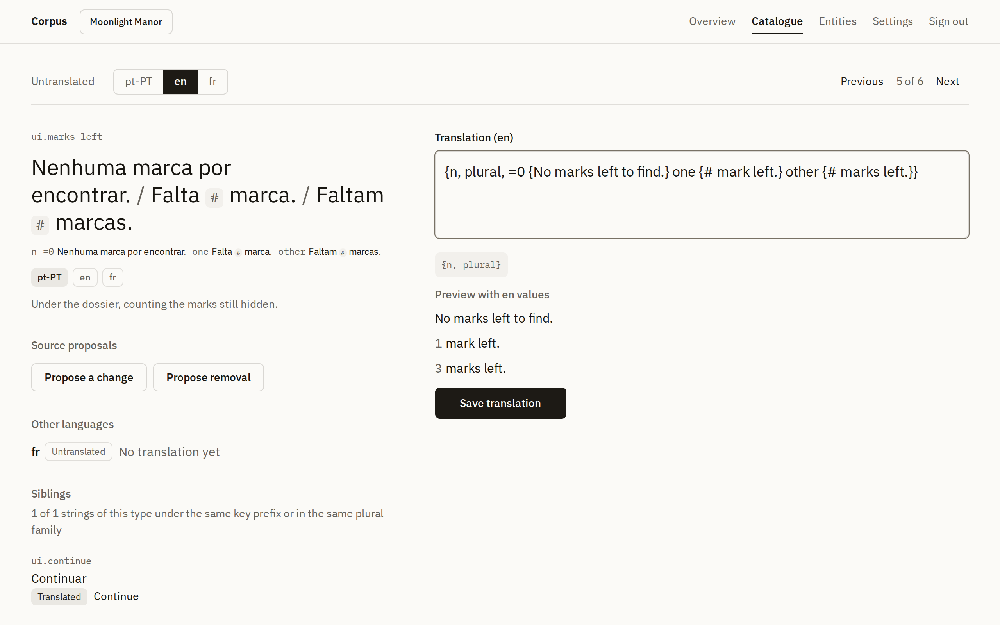

<h1 align="center">Corpus</h1>

<p align="center">
  A self-hosted translation workbench for games and apps whose text is structured.<br>
  Your repository stays the source of truth. Corpus is where people translate and verify it,<br>
  and where an agent, through MCP or the CLI, drafts for them.
</p>

<p align="center">
  <a href="https://github.com/miguelaguiar01/corpus/actions/workflows/gate.yml"></a>
  
  
  
  <a href="https://www.npmjs.com/package/@corpus-tool/cli"></a>
  
</p>

<p align="center">
  <picture>
    <source media="(prefers-color-scheme: dark)" srcset="docs/screenshots/editor-structured-desktop-dark.png">
    
  </picture>
</p>

<p align="center"><em>A string from the fixture project, Moonlight Manor: one sentence, two gendered selects, three placeholders, and a live preview for each example the repository shipped with it.</em></p>

## Why Corpus

Flat key-value translation tools lose what makes game and app text hard: the placeholder that arrives with a Portuguese contraction baked in, the select that branches on a character's gender, the room the sentence is about. Corpus keeps all of it in view while someone translates.

- **Structured text, first class.** Strings carry placeholders, ICU selects and plurals, rich-text tags, metadata, and references to the entities they mention. The editor renders a select or a plural as its branches, never as syntax, and chips insert placeholders and select and plural skeletons, a plural's with the target language's categories, so nobody types braces by hand.
- **Previews without running your code.** Each string can ship examples, slot values plus the source render, and the editor substitutes them into the draft as it is typed, one preview per example, both branches of a select exercised.
- **The repository stays the truth.** `corpus push` diffs the repo into Corpus by string id, and carries the translations the repository already has, so nothing already translated shows as untranslated; `corpus pull` writes verified translations back through the same adapters, format-preserving. Push then pull reproduces the repository byte for byte, and that invariant is a test in the gate.
- **A workflow, not a spreadsheet.** Every string and language moves untranslated, translated, verified, with a stale mark when the source changes underneath, an attributed history of every edit, and queues that tell a translator what to work on next.
- **One command, or one container.** `npx corpus workbench` runs an instance on your machine from two npm packages, database included. For a team it is one image with its database on a volume. No external services; accounts are a name and a password, and one invite secret admits people.
- **Works at whatever width a translator has.** Every surface was designed at 390px first and built out from there, so the same queues and editor work from a phone, a tablet or a desktop.
- **Agents draft; people verify.** `corpus mcp` is a Model Context Protocol server for Claude Code or any MCP client; `corpus agent` is the same operations as shell commands. An agent reads queues and strings as the editor shows them, saves drafts and proposes source changes, under three rules: it never overwrites a person's work, every draft is attributed, and only a signed-in maintainer verifies. Corpus runs no model.

Corpus translates its own interface with itself. That is the standing demo in these screenshots and a test that runs on every build.

## Quick start

You need Node 22 and nothing else. In the repository whose text you want translated:

```sh
npm install --save-dev @corpus-tool/cli @corpus-tool/workbench
npx corpus init --project my-game --source en \
  --messages "src/i18n/{lang}.json" --server http://localhost:3000
npx corpus workbench
```

`init` writes `corpus.config.ts`, the whole configuration for a repository whose strings are a plain message catalog: it reads the languages from the files and the i18n library from the source catalogue, and takes `--languages` and `--library` when you would rather say. `workbench` starts an instance at http://localhost:3000, creates the project the config declares, and prints the invite secret it generated; the project's token is written to `.corpus/token`, so in another shell:

```sh
npx corpus push          # the repository's text is in Corpus
npx corpus status        # how far along each language is, from the terminal
```

Open the URL, join with the secret, a display name and a password, and you are the maintainer: translate, verify, then `npx corpus pull` writes the verified translations back into the repository's files. The database, the secret and the token live under `.corpus/`, which `init` and `workbench` both add to `.gitignore`, creating the file when there is none, so the token is ignored on the team path too, where `project create` prints it and the workbench never runs; delete the directory to start over. Updating is `npm update` of the two packages, which always share a version. A package manager with a release-age policy holds back a version published inside its window, and the three write it differently: pnpm's `minimumReleaseAge` in `pnpm-workspace.yaml`, yarn's `npmMinimalAgeGate` in `.yarnrc.yml`, npm's `min-release-age` in `.npmrc`. Each has an allow list for the packages a team trusts on release day: `minimumReleaseAgeExclude`, `npmPreapprovedPackages` and `min-release-age-exclude[]`, where `@corpus-tool/cli` and `@corpus-tool/workbench` are worth naming once. Yarn and npm refuse the install outright; pnpm installs the fresh version and writes the exclusion into `pnpm-workspace.yaml` itself, pinned to that version and saying so, unless `minimumReleaseAgeStrict` is on, when it asks first, or fails where there is no terminal to ask. Otherwise install the previous release, or wait the window out.

## For a team

Translators need a URL they can reach, so a team runs the published image, the same app at the same version, with its database on a volume:

```sh
git clone https://github.com/miguelaguiar01/corpus.git
cd corpus
CORPUS_INVITE_SECRET="$(openssl rand -hex 24)" docker compose pull
CORPUS_INVITE_SECRET="$(openssl rand -hex 24)" docker compose up -d
```

`compose.yaml` names `ghcr.io/miguelaguiar01/corpus:latest`; set `CORPUS_IMAGE_TAG` to pin a version. The first person to join with the secret becomes the maintainer; anyone with the secret can join, and after that they sign in with their name and password. A maintainer can reset a forgotten password from the settings page. All data lives in the `corpus-data` volume; the container is disposable. Without the image, `docker compose up -d --build` builds it from the checkout.

Two things to know before exposing it: mount a directory, never a single file (SQLite runs in WAL mode and keeps `-wal` and `-shm` files beside the database), and put it behind HTTPS to reach it from other devices, because the session cookie is `Secure` for any host other than localhost (set `CORPUS_PUBLIC_URL` to your HTTPS origin behind a proxy). `/api/health` reports the build it is running (the `CORPUS_VERSION` build argument, a tag or a commit from `git describe`), so an instance is traceable to a commit without logging in; without the argument it says `dev`.

## Connect a repository

The CLI never guesses where text lives; `corpus.config.ts` declares it:

```ts
import { defineCorpus } from "@corpus-tool/cli";

export default defineCorpus({
  project: "my-game",
  server: "http://localhost:3000",
  sourceLanguage: "en",
  languages: ["en", "pt-PT"],
  sources: [
    { adapter: "messages", type: "chrome", path: "src/i18n/{lang}.json" },
  ],
});
```

`corpus init` writes it, as the quick start above does. The commands:

```sh
npx corpus build                      # no server: runs the sources, validates, prints a summary
npx corpus push                       # repo → Corpus: adds, changes, marks stale, archives
npx corpus status                     # per-language and per-type counts; --json for a script
npx corpus pull                       # Corpus → repo: verified translations only
npx corpus pull --check               # writes nothing; exit 1 if a pull would change a file
npx corpus validate                   # no server: every translation still fits its source
npx corpus check                      # lint: user-facing literals outside declared sources
```

The [wiki](https://github.com/miguelaguiar01/corpus/wiki) is where this is explained: [the config file](https://github.com/miguelaguiar01/corpus/wiki/The-config-file) field by field, [sources and adapters](https://github.com/miguelaguiar01/corpus/wiki/Sources-and-adapters) for catalogues, tables and an exporter of your own, and [your i18n library](https://github.com/miguelaguiar01/corpus/wiki/Your-i18n-library) for next-intl, i18next and the rest.

Note that the commands run the repository's own `corpus.config.ts`, and `push`, `build` and `pull` run the `exec` commands it declares, so run them only in repositories you trust, as you would their build scripts.

## Manage the strings, not only their translations

The catalogue is the inventory, and anyone on the instance can propose a change to it: a new source text on a string's page, a string's removal, or a new string into one of the repository's catalogues, chosen from the sources `corpus push` declared. A proposal is pending until `corpus pull` writes it into the source file, you review the diff and merge, and the next `corpus push` sees the repository agreeing and marks it applied. The repository stays the truth once merged; Corpus proposes. `corpus status` counts what is pending, and `corpus pull --check` treats a pending proposal as a change to pull, so a CI gate goes red until it is in.

<p align="center">
  <picture>
    <source media="(prefers-color-scheme: dark)" srcset="docs/screenshots/proposal-desktop-dark.png">
    
  </picture>
</p>

<p align="center">
  <picture>
    <source media="(prefers-color-scheme: dark)" srcset="docs/screenshots/agent-draft-desktop-dark.png">
    
  </picture>
</p>

## Work with an agent

`corpus mcp` starts a [Model Context Protocol](https://modelcontextprotocol.io) server on stdio from the repository, reading the config and the token like every other command, so an agent in the repository works inside the project with no browser. Three things first, in this order:

1. **The instance must run the same Corpus version as the CLI.** The token routes that the tools call arrived in 0.8.0; an older instance, a `corpus workbench` started from an older `@corpus-tool/workbench` or a container on an older image tag, answers `status` and nothing else. Bump both packages together and start the workbench again, or pull the matching image; `corpus status` prints the server's version.
2. **Push once after upgrading.** The instance learns which source files can take proposals from a push; until then every proposal is refused as "last pushed before sources were declared". `corpus status` prints the writable sources when it knows them, and says so when a project has none: only `.json` catalogues take proposals, so a project whose text all comes from an exporter never will.
3. **Register the server before the session starts.** A client loads tool schemas when a session opens, and a running agent cannot restart itself, so registering from inside an agent's session gives that session nothing. Register, then start.

### Connecting a client

Any MCP client that speaks stdio can run it. The server is the command `npx corpus mcp`, started in the repository: the working directory is how it finds `corpus.config.ts` and `.corpus/token`. A client that starts servers elsewhere (a desktop app) needs either a `cwd` field in its entry set to the repository, where the client has one, or a command that changes into it first, `sh -c "cd /path/to/repo && npx corpus mcp"`; `CORPUS_TOKEN` in the entry's environment stands in for `.corpus/token` in either case. The entries below are the same server in each client's spelling.

**Claude Code.** `claude mcp add corpus -- npx corpus mcp`, or the repository's `.mcp.json`, which the whole team shares through git:

```json
{ "mcpServers": { "corpus": { "command": "npx", "args": ["corpus", "mcp"] } } }
```

Claude Desktop, Cursor, VS Code, Codex, Gemini CLI and a client of your own each take an entry of their own shape; [The MCP server](https://github.com/miguelaguiar01/corpus/wiki/The-MCP-server) has all of them, the nine tools, and a recorded session.

Its tools are one API call each: `list_queue`, `get_string`, `save_draft`, `propose_change`, `propose_removal`, `add_string`, `list_proposals`, `withdraw_proposal` and `status`. Three rules hold for everything an agent writes through the project token: it never overwrites a person's work, every draft is attributed to the project's agent actor, and nothing but a signed-in maintainer verifies. [What an agent may and may not do](https://github.com/miguelaguiar01/corpus/wiki/What-an-agent-may-and-may-not-do) is those rules and the refusals that enforce them.

An agent with a shell and no MCP client has the same operations as `corpus agent` subcommands, and `corpus agent --stdin` runs many through one process; [Agents without MCP](https://github.com/miguelaguiar01/corpus/wiki/Agents-without-MCP) covers both. The model stays on the agent's side; Corpus runs none.

## In CI

Nothing here needs a browser. `corpus check` and `corpus validate` read only the repository, so they run on a fork's pull request; `corpus pull --check` gates a merge on the repository carrying what is verified, and `corpus push` runs on the default branch. [Corpus in CI](https://github.com/miguelaguiar01/corpus/wiki/Corpus-in-CI) has a complete workflow, what each step costs, and which ones need the token.

## How it works

```
repository ──corpus push──▶ Corpus (agents draft, people verify) ──corpus pull──▶ repository files ──PR──▶ merged
```

Source text and metadata belong to the repository, which wins once merged; Corpus proposes changes to them. Translations and workflow states belong to Corpus. The database is a working copy with history: losing it loses only edits not yet pulled.

| Surface   | What it is for                                                                                                                                            |
| --------- | --------------------------------------------------------------------------------------------------------------------------------------------------------- |
| Dashboard | The queues (untranslated, stale, unverified source, and agent drafts once there are any) and per-language progress by string type. A translator never wonders what to work on. |
| Catalogue | Every string, searched (accent-insensitive full text) and filtered by type, state, language, and the project's own metadata.                              |
| Editor    | The source with its branches, placeholders, metadata, entities, examples, the type's note, the glossary terms in it and its siblings on one side; the draft with chips, validation and live previews on the other. |
| Entities  | Read-only cards for the characters, rooms and other objects the strings refer to.                                                                         |
| Settings  | The push token, languages, push history, and the people on the instance, with password resets. Maintainers only.                                         |

## Screens

<p align="center">
  <picture>
    <source media="(prefers-color-scheme: dark)" srcset="docs/screenshots/dashboard-desktop-dark.png">
    
  </picture>
</p>

<p align="center">
  <picture>
    <source media="(prefers-color-scheme: dark)" srcset="docs/screenshots/catalogue-desktop-dark.png">
    
  </picture>
</p>

<details>
<summary>More screens: home, a plain string in the editor, the entity browser, a plural in the editor, settings, and a phone</summary>
<p align="center">
  <picture>
    <source media="(prefers-color-scheme: dark)" srcset="docs/screenshots/home-desktop-dark.png">
    
  </picture>
  <picture>
    <source media="(prefers-color-scheme: dark)" srcset="docs/screenshots/editor-desktop-dark.png">
    
  </picture>
  <picture>
    <source media="(prefers-color-scheme: dark)" srcset="docs/screenshots/entities-desktop-dark.png">
    
  </picture>
  <picture>
    <source media="(prefers-color-scheme: dark)" srcset="docs/screenshots/editor-plural-desktop-dark.png">
    
  </picture>
  <picture>
    <source media="(prefers-color-scheme: dark)" srcset="docs/screenshots/settings-desktop-dark.png">
    
  </picture>
  <picture>
    <source media="(prefers-color-scheme: dark)" srcset="docs/screenshots/dashboard-dark.png">
    
  </picture>
</p>
</details>

Every screen follows the system light or dark preference. The visual system, the tokens, the type scale and the rules behind it, is written down in [`docs/design.md`](docs/design.md).

## Configuration

Environment variables are documented in [`apps/web/.env.example`](apps/web/.env.example). Every way of running an instance shares one code path; only these differ:

| Variable               | `corpus workbench`                | Container                         | Checkout                       |
| ---------------------- | --------------------------------- | --------------------------------- | ------------------------------ |
| `CORPUS_INVITE_SECRET` | generated into `.corpus/secret`   | `-e` or compose                   | required, from `apps/web/.env` |
| `CORPUS_DB_PATH`       | `.corpus/corpus.db` (`--db`)      | `/data/corpus.db` on the volume   | `apps/web/data/corpus.db`      |
| `PORT`                 | `3000` (`--port`)                 | `3000`                            | `3000`                         |
| `CORPUS_PUBLIC_URL`    | unset                             | the public origin, behind a proxy | unset                          |

The CLI reads the project token from `CORPUS_TOKEN`, then from `.corpus/token`, which `corpus workbench` writes; `corpus project create` needs the instance secret in `CORPUS_INVITE_SECRET`, or reads `.corpus/secret` when the server is the local workbench. Migrations apply automatically when the app starts, and the boot log names the database file it opened.

## Local development

The same app runs as a plain local process. You need Node 22 (see `.nvmrc`) and npm:

```sh
git clone https://github.com/miguelaguiar01/corpus.git
cd corpus
npm install
cp apps/web/.env.example apps/web/.env   # then set CORPUS_INVITE_SECRET
npm run dev
```

The database is created on first start at `apps/web/data/corpus.db` and is gitignored; delete it to start over.

`bin/gate` is the one quality gate, locally and in CI: typecheck, lint, format, both package builds, the full test suite, and `corpus check` and `corpus validate` on this repository's own interface strings. `bin/smoke` walks the whole loop in a browser, invite to verified translation, on a phone viewport and then checks the desktop layouts; `bin/container-smoke` builds and boots the production image; `bin/install-smoke` installs the packed CLI and workbench into a fresh repository and round-trips it against `corpus workbench` and then against that image; `bin/screenshots` regenerates the images above. Releases are tags: see `AGENTS.md`.

## Documentation

- [`docs/corpus-design.md`](docs/corpus-design.md), the binding design: the data model, the ICU subset, sync semantics, the round-trip invariant, and what Corpus deliberately does not do.
- [`docs/design.md`](docs/design.md), the visual system.
- [`docs/DECISIONS.md`](docs/DECISIONS.md), architecture decisions as they were made.
- [`AGENTS.md`](AGENTS.md), how work happens here: the spec is binding, the gate must pass before a PR, every PR is reviewed by someone other than its author, and the round-trip invariant is never merged red.

## License

[MIT](LICENSE).
