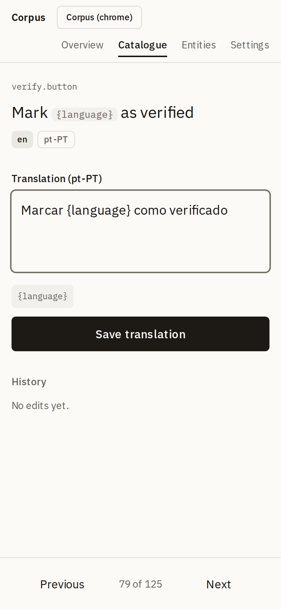
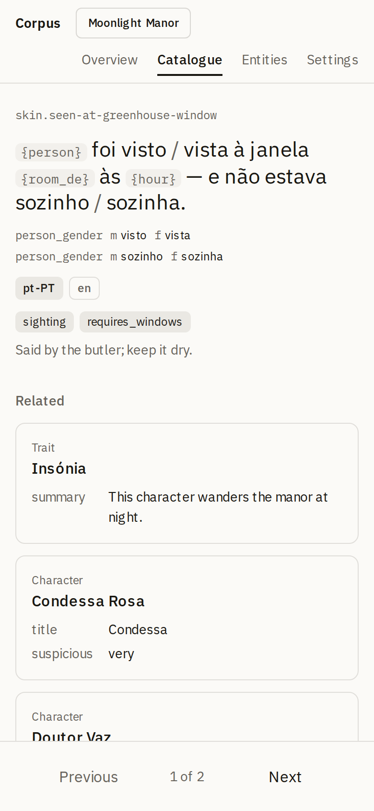
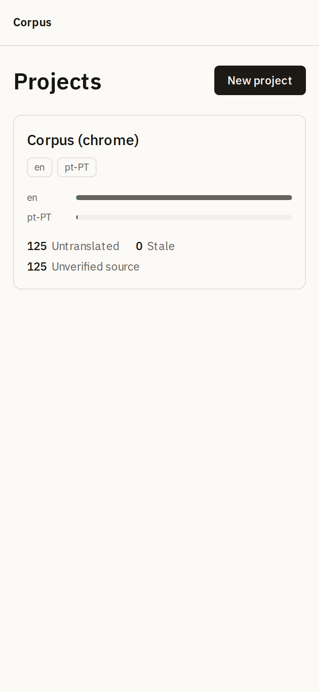
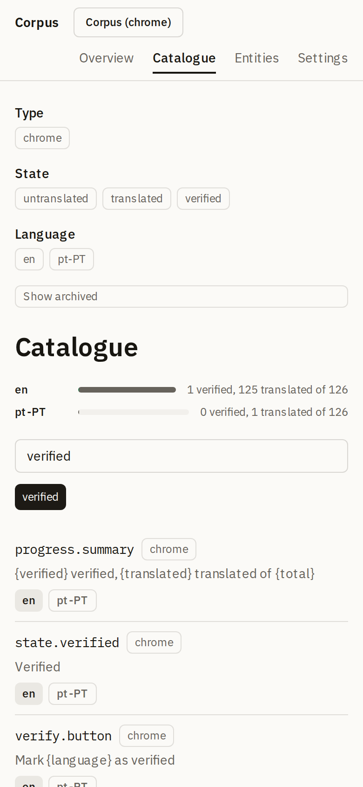
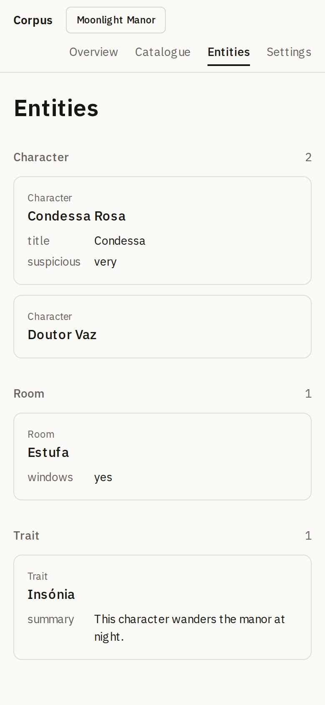
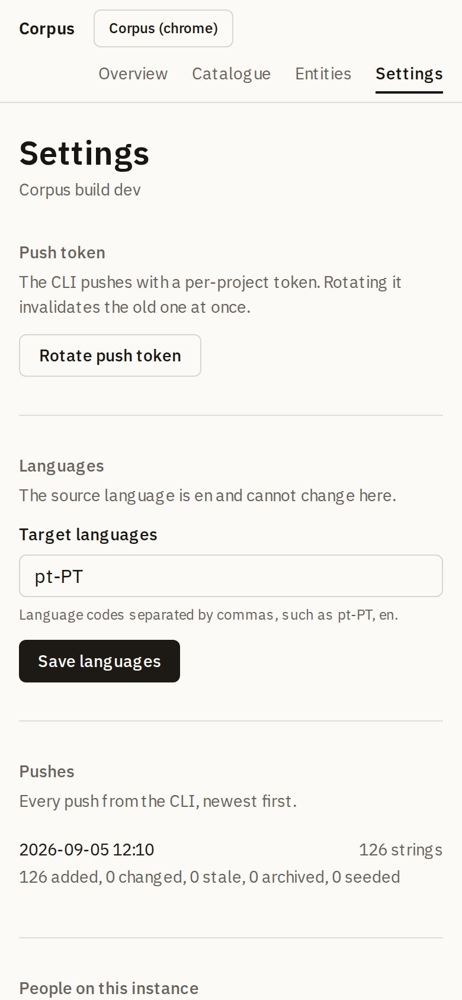

# Corpus

Corpus is a self-hosted, lightweight translation workbench for games and
apps whose text is *structured*: strings that carry metadata, placeholders,
relations to game objects, and rendering context that flat key-value TMS
tools can't represent well.

Text lives in each project's git repository; Corpus is an editing surface,
never the source of truth. A CLI (`corpus push` / `corpus pull`) syncs the
two, and the round-trip is provably lossless. Corpus translates its own UI
with itself, which is the standing demo below and a test that runs on
every build.

<p>
  <picture>
    <source media="(prefers-color-scheme: dark)" srcset="docs/screenshots/editor-structured-desktop-dark.png">
    
  </picture>
</p>

*The editor on a desktop, on the fixture project Moonlight Manor: a source
with two selects reads as one sentence, the keys sit in a strip beneath
it, and the previews substitute the string's own example values.*

<p>
  <picture>
    <source media="(prefers-color-scheme: dark)" srcset="docs/screenshots/dashboard-dark.png">
    
  </picture>
  <picture>
    <source media="(prefers-color-scheme: dark)" srcset="docs/screenshots/editor-dark.png">
    
  </picture>
  <picture>
    <source media="(prefers-color-scheme: dark)" srcset="docs/screenshots/editor-structured-dark.png">
    
  </picture>
</p>

*Corpus translating Corpus on a phone, light and dark, which is where
translators mostly work. The third screen is Moonlight Manor again.*

<details>
<summary>More screens: home, catalogue, entity browser, maintainer settings</summary>
<p>
  <picture>
    <source media="(prefers-color-scheme: dark)" srcset="docs/screenshots/home-dark.png">
    
  </picture>
  <picture>
    <source media="(prefers-color-scheme: dark)" srcset="docs/screenshots/catalogue-dark.png">
    
  </picture>
  <picture>
    <source media="(prefers-color-scheme: dark)" srcset="docs/screenshots/entities-dark.png">
    
  </picture>
  <picture>
    <source media="(prefers-color-scheme: dark)" srcset="docs/screenshots/settings-dark.png">
    
  </picture>
</p>
</details>

## Self-hosting

Corpus ships as a single container with its SQLite database on a
volume. You need Docker and nothing else:

```sh
git clone https://github.com/miguelaguiar01/corpus.git
cd corpus
docker build -t corpus .
docker run -d --name corpus \
  -p 3000:3000 \
  -e CORPUS_INVITE_SECRET="$(openssl rand -hex 24)" \
  -v corpus-data:/data \
  corpus
```

Then open http://localhost:3000. You'll be asked for the invite secret
you just set and a display name. The first person to join becomes the
instance maintainer. All data lives in the `corpus-data` volume; the
container itself is disposable.

Mount a **directory**, never a single file: SQLite runs in WAL mode and
keeps `-wal` and `-shm` files next to the database, so a bind mount of
`corpus.db` alone would break writes.

To reach the instance from other devices, put it behind HTTPS (any
reverse proxy or a PaaS like Coolify works): the session cookie is
marked `Secure` in production, so browsers won't send it over plain
http except on localhost.

With Docker Compose (or a PaaS that reads `compose.yaml`):

```sh
CORPUS_INVITE_SECRET="$(openssl rand -hex 24)" docker compose up -d
```

`/api/health` reports the build it is running (`git describe` at build
time), so an instance is traceable to a commit without logging in.

## Local development

The same app runs as a plain local process, no Docker involved. You need
Node 22 (see `.nvmrc`) and npm:

```sh
git clone https://github.com/miguelaguiar01/corpus.git
cd corpus
npm install
cp apps/web/.env.example apps/web/.env   # then set CORPUS_INVITE_SECRET
npm run dev
```

Open http://localhost:3000, enter the invite secret from your `.env`
and a display name. The database is created on first start at
`apps/web/data/corpus.db` and is gitignored; delete it to start over.

Two local checks mirror CI: `bin/gate` (typecheck, lint, tests, and
`corpus check` on this repo's own chrome) and `bin/container-smoke`
(build and boot the production image, needs Docker). `bin/smoke` runs the
Playwright walk-through on a phone viewport, and `bin/screenshots`
regenerates the images above.

## The CLI

A project declares where its text lives in a `corpus.config.ts`; the CLI
never guesses. This is the whole configuration for a repo whose strings
are a plain message catalog:

```ts
import { defineCorpus } from "@corpus/contract";

export default defineCorpus({
  project: "my-game",
  server: process.env.CORPUS_SERVER ?? "http://localhost:3000",
  sourceLanguage: "en",
  languages: ["en", "pt-PT"],
  sources: [
    { adapter: "messages", type: "chrome", path: "src/i18n/{lang}.json" },
  ],
});
```

Create the project in the web app (you get a push token once), then from
the project's repository:

```sh
export CORPUS_SERVER=http://localhost:3000 CORPUS_TOKEN=<token>
corpus push                     # repo → Corpus: adds, changes, marks stale, archives
corpus pull                     # Corpus → repo: verified translations only
corpus pull --min-state translated
corpus check                    # lint: user-facing literals outside declared sources
```

Pushing is a diff by string id: new ids are added, changed source text
marks its translations stale, ids that disappear are archived with their
history kept. Pulling writes translations back through the same adapters,
format-preserving, and prints only the files it changed. Pushing then
pulling reproduces the repository byte for byte; that invariant is a test
in the gate.

The CLI is not published to npm yet. From this repository, `corpus` is
`npx tsx packages/cli/src/bin.ts`, run from the client project's
directory. Structured sources (`table` records with metadata fields, or an
`exec` command that emits entries) are described in the design spec, §3.

## Configuration

Environment variables are documented in
[`apps/web/.env.example`](apps/web/.env.example). Local and container
runs share one code path; only these differ by environment:

| Variable | Local default | Container |
| --- | --- | --- |
| `CORPUS_INVITE_SECRET` | required, from `apps/web/.env` | `-e` at `docker run` |
| `CORPUS_DB_PATH` | `apps/web/data/corpus.db` | `/data/corpus.db` on the volume |
| `PORT` | `3000` | `3000` |

Migrations apply automatically when the app starts, and the boot log
names the database file it opened.

## How it works

```
client repo ──corpus push──▶ web app (people verify and translate) ──corpus pull──▶ repo files ──PR──▶ merged truth
```

Source text and metadata belong to the repository; translations and
workflow states belong to Corpus. Each string × language moves
`untranslated → translated → verified`, with a `stale` mark when the
source changes underneath, and every edit is logged with who and when.
The database is a working copy with history: losing it loses only edits
not yet pulled.

The binding design lives in
[`docs/corpus-design.md`](docs/corpus-design.md), including why key-value
TMS tools don't fit structured game text and what Corpus deliberately does
not do. Architecture decisions are logged in
[`docs/DECISIONS.md`](docs/DECISIONS.md).

## Working on Corpus

[`AGENTS.md`](AGENTS.md) is the workflow: the spec is binding, `bin/gate`
must pass before a PR, every PR is reviewed by someone other than its
author, and the round-trip invariant is never merged red. Work is tracked
on the project board linked from the repository.
